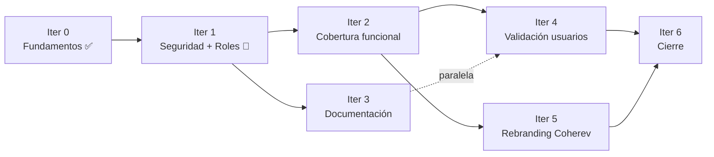

# ROADMAP — PR-Intra · Coherev

> Reemplaza la carta Gantt del PPT (Capstone - 003D).
> Metodología ágil: iteraciones outcome-driven, sin fechas duras, sin diagrama Gantt.
> Sincronizado con [`BACKLOG.md`](./BACKLOG.md) — cada tarjeta del backlog vive en una iteración.

---

## Equipo

- **Benjamín Herrera** · Backend (Laravel, BD, Policies, Reverb)
- **Julián Tapia** · Frontend (Next.js, UI/UX, realtime client)

---

## Vista ágil (Now / Next / Later)

| Estado | Iteración |
|---|---|
| **Now** (activa) | Iter 1 — Seguridad y Roles |
| **Next** (próximas) | Iter 2 — Cobertura funcional · Iter 3 — Documentación *(paralela)* |
| **Later** | Iter 4 — Validación con usuarios · Iter 5 — Rebranding Coherev · Iter 6 — Cierre |

---

## Iteraciones

### Iter 0 — Fundamentos ✅
- Setup monorepo Laravel 13 + Next.js 16
- Modelos base y migraciones
- Login + me + logout
- Sidebar base con onboarding driver.js

---

### Iter 1 — Seguridad y Roles 🔴 (ACTIVA)
- Rate-limit en login
- Autorización UserController (solo admin)
- Autorización DepartmentController (solo admin)
- Autorización RoleController (solo admin)
- Validar MIME real en uploads
- Modelar 4 roles (Administrador, Líder, Colaborador, Nuevo Ingreso)
- Refactor `canManageAnnouncements()`

---

### Iter 2 — Cobertura funcional 🔴
- Sidebar y rutas según los 4 roles
- Autorización DocumentController (admin o dueño)
- Conectar tabla `MessageRead` (contador desde BD)
- Módulo Tareas (tablero Kanban interno por equipo)
- Módulo Directorio (vista pública de colaboradores)
- Panel Novedades para nuevos ingresos

---

### Iter 3 — Documentación 🟡 *(paralela a Iter 2)*
- Diagrama de arquitectura
- Diagrama ER de la BD
- Documento de RF y RNF
- Historias de usuario
- Matriz de trazabilidad Problema → RF → HU → Funcionalidad → Prueba

---

### Iter 4 — Validación con usuarios 🟡
- Capturas del tablero Trello real
- Acta de pruebas con usuarios reales
- Definir métricas SMART para el objetivo general
- Implementar métricas operativas en código

---

### Iter 5 — Rebranding Coherev 🟡

#### 5.1 Identidad
- Wordmark + isotipo + tagline Coherev
- Refinar tokens CSS (mantener paleta actual)
- Voice & tone Coherev + microcopy
- Favicon + metadata global + 404 branded

#### 5.2 Pantallas
- Rebranding del login
- Rebranding del sidebar
- Rebranding del dashboard
- Rebranding de páginas internas
- Onboarding tour con marca Coherev
- Empty states ilustrados y consistentes

#### 5.3 Polish técnico
- Sidebar móvil (drawer)
- Accesibilidad WCAG AA
- Errores por campo en formularios
- Vista móvil del chat mejorada

---

### Iter 6 — Cierre 🟡
- Corregir inconsistencia MySQL↔MariaDB en PPT
- Documentar Reverb/Pusher en stack del PPT
- README raíz actualizado con Coherev
- Ensayo de presentación

---

## Dependencias entre iteraciones

- **Iter 1** bloquea a Iter 2 (roles deben existir antes de modular).
- **Iter 3** puede correr en paralelo con Iter 2 (no toca código de producto).
- **Iter 5** depende de Iter 2 (frontend estable para refactorizar marca).
- **Iter 6** espera a todas las anteriores.

---

## Cadencia

| Ritual | Frecuencia | Duración |
|---|---|---|
| Daily sync | Diaria | 15 min |
| Pull semanal | Lunes | 30 min |
| Demo de cierre de iteración | Al cumplir DoD | 20 min |
| Checkpoint académico | Antes de cada entrega con Cindy | 60 min |

**WIP máximo por persona**: 3 tarjetas simultáneas.

---

## Definition of Done (universal)

- Código mergeado a la rama principal
- Tests automatizados pasando (PHPUnit en backend)
- Verificación manual del flujo afectado
- Tarjeta movida a "Hecho" en Trello con fecha
- `BACKLOG.md` actualizado con `Cerrada: YYYY-MM-DD`
- Si la tarjeta es de documentación (`DOC-*`, `EVI-*`), archivo subido a `docs/` o `docs/evidence/`

---

## Checkpoint con Cindy (próxima presentación)

- [ ] Observación 2 (RF/RNF): `docs/REQUIREMENTS.md`
- [ ] Observación 6 (HU): `docs/USER_STORIES.md`
- [ ] Observación 7 (arquitectura): `docs/ARCHITECTURE.md`
- [ ] Observación 8 (ER): `docs/DATABASE.md`
- [ ] Observación 11 (validación usuarios): `docs/evidence/usability-test.md`
- [ ] Observación 13 (Kanban evidencia): capturas del Trello en `docs/evidence/`
- [ ] Observación 14 (trazabilidad): `docs/TRACEABILITY.md`
- [ ] Observación 15 (seguridad): rate-limit + tests de autorización pasando
