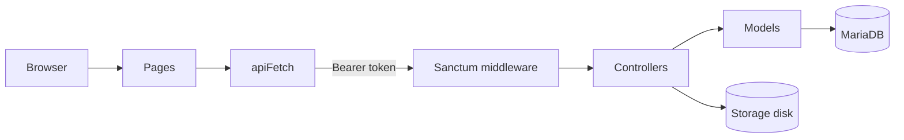

# Architecture (front <-> back)

Generated by joining `apiFetch('...')` calls in the frontend with `Route::...` entries in `backend/routes/api.php`.

## Request flow

## Joined map

| Front file | Calls | Backend route | Auth |
|---|---|---|---|
| `app/dashboard/conversations/page.tsx` | `DELETE /messages/{id}`, `GET chat-partners`, `GET departments`, `GET me`, `GET roles`, `GET users/{user}/roles`, `POST departments`, `POST roles`, `PUT users/{user}/roles` | `DELETE /messages/{id}, GET chat-partners, GET departments, GET me, GET roles, GET users/{user}/roles, POST departments, POST roles, PUT users/{user}/roles` | admin, authenticated |
| `app/dashboard/departments/page.tsx` | `DELETE departments/{department}`, `DELETE roles/{role}`, `GET departments`, `GET departments/{department}`, `GET departments/{department}/roles`, `GET me`, `GET roles`, `GET roles/{role}`, `PATCH departments/{department}`, `PATCH roles/{role}`, `POST departments`, `POST roles`, `PUT departments/{department}`, `PUT roles/{role}` | `DELETE departments/{department}, DELETE roles/{role}, GET departments, GET departments/{department}, GET departments/{department}/roles, GET me, GET roles, GET roles/{role}, PATCH departments/{department}, PATCH roles/{role}, POST departments, POST roles, PUT departments/{department}, PUT roles/{role}` | admin, authenticated |
| `app/dashboard/documents/page.tsx` | `DELETE /documents/{id}`, `GET me` | `DELETE /documents/{id}, GET me` | admin, authenticated |
| `app/dashboard/page.tsx` | `GET me` | `GET me` | authenticated |
| `app/dashboard/publications/page.tsx` | `GET departments`, `GET me`, `POST departments` | `GET departments, GET me, POST departments` | admin, authenticated |
| `app/dashboard/tasks/page.tsx` | `GET me` | `GET me` | authenticated |
| `app/dashboard/trash/page.tsx` | `GET me` | `GET me` | authenticated |
| `app/dashboard/users/page.tsx` | `GET departments`, `GET departments/{department}/roles`, `GET me`, `GET users/{user}/roles`, `POST departments`, `PUT users/{user}/roles` | `GET departments, GET departments/{department}/roles, GET me, GET users/{user}/roles, POST departments, PUT users/{user}/roles` | admin, authenticated |
| `app/page.tsx` | `GET me`, `POST login` | `GET me, POST login` | authenticated, default |

Total joined: 49
Unmatched calls: 24

### Unmatched (front calls without matching route)

- `app/dashboard/conversations/page.tsx` calls `/conversations`
- `app/dashboard/conversations/page.tsx` calls `/conversations`
- `app/dashboard/conversations/page.tsx` calls `/conversations/${conversationId}/read`
- `app/dashboard/conversations/page.tsx` calls `/conversations/${selectedConversation.id}/messages`
- `app/dashboard/conversations/page.tsx` calls `/conversations`
- `app/dashboard/conversations/page.tsx` calls `/messages`
- `app/dashboard/conversations/page.tsx` calls `/conversations/${conversation.id}`
- `app/dashboard/conversations/page.tsx` calls `/conversations/${selectedConversation.id}`
- `app/dashboard/documents/page.tsx` calls `/documents`
- `app/dashboard/page.tsx` calls `/conversations`
- `app/dashboard/page.tsx` calls `/conversations/${conversation.id}/messages`
- `app/dashboard/page.tsx` calls `/announcements`
- `app/dashboard/publications/page.tsx` calls `/announcements`
- `app/dashboard/publications/page.tsx` calls `/announcements/${editingAnnouncementId}`
- `app/dashboard/publications/page.tsx` calls `/announcements`
- `app/dashboard/publications/page.tsx` calls `/announcements/${announcement.id}`
- `app/dashboard/publications/page.tsx` calls `/announcements/${announcement.id}`
- `app/dashboard/trash/page.tsx` calls `/trash`
- `app/dashboard/trash/page.tsx` calls `/trash/${type === "message" ? "messages" : "documents"}/${id}/restore`
- `app/dashboard/trash/page.tsx` calls `/trash/${type === "message" ? "messages" : "documents"}/${id}`
- `app/dashboard/users/page.tsx` calls `/users`
- `app/dashboard/users/page.tsx` calls `/users/${editingUserId}`
- `app/dashboard/users/page.tsx` calls `/users`
- `app/dashboard/users/page.tsx` calls `/users/${u.id}`

## Coverage by route

Which backend routes are exercised by which frontend files:

| Backend route | Auth | Called from |
|---|---|---|
| `DELETE /api/documents/{id}` | admin | `app/dashboard/documents/page.tsx` |
| `DELETE /api/messages/{id}` | admin | `app/dashboard/conversations/page.tsx` |
| `DELETE /apicomments/{comment}` | authenticated | _no frontend caller yet_ |
| `DELETE /apidepartments/{department}` | admin | `app/dashboard/departments/page.tsx` |
| `DELETE /apiroles/{role}` | admin | `app/dashboard/departments/page.tsx` |
| `GET /api/` | admin | _no frontend caller yet_ |
| `GET /apiannouncements/{announcement}/comments` | authenticated | _no frontend caller yet_ |
| `GET /apichat-partners` | authenticated | `app/dashboard/conversations/page.tsx` |
| `GET /apidepartments` | authenticated | `app/dashboard/conversations/page.tsx`, `app/dashboard/departments/page.tsx`, `app/dashboard/publications/page.tsx`, `app/dashboard/users/page.tsx` |
| `GET /apidepartments/{department}` | authenticated | `app/dashboard/departments/page.tsx` |
| `GET /apidepartments/{department}/roles` | authenticated | `app/dashboard/departments/page.tsx`, `app/dashboard/users/page.tsx` |
| `GET /apidocuments/{document}/download` | authenticated | _no frontend caller yet_ |
| `GET /apime` | authenticated | `app/dashboard/conversations/page.tsx`, `app/dashboard/departments/page.tsx`, `app/dashboard/documents/page.tsx`, `app/dashboard/page.tsx`, `app/dashboard/publications/page.tsx`, `app/dashboard/tasks/page.tsx`, `app/dashboard/trash/page.tsx`, `app/dashboard/users/page.tsx`, `app/page.tsx` |
| `GET /apiroles` | authenticated | `app/dashboard/conversations/page.tsx`, `app/dashboard/departments/page.tsx` |
| `GET /apiroles/{role}` | authenticated | `app/dashboard/departments/page.tsx` |
| `GET /apiusers/{user}/roles` | admin | `app/dashboard/conversations/page.tsx`, `app/dashboard/users/page.tsx` |
| `PATCH /apidepartments/{department}` | admin | `app/dashboard/departments/page.tsx` |
| `PATCH /apiroles/{role}` | admin | `app/dashboard/departments/page.tsx` |
| `POST /api/documents/{id}/restore` | admin | _no frontend caller yet_ |
| `POST /api/messages/{id}/restore` | admin | _no frontend caller yet_ |
| `POST /apiannouncements/{announcement}/comments` | authenticated | _no frontend caller yet_ |
| `POST /apidepartments` | admin | `app/dashboard/conversations/page.tsx`, `app/dashboard/departments/page.tsx`, `app/dashboard/publications/page.tsx`, `app/dashboard/users/page.tsx` |
| `POST /apilogin` | default | `app/page.tsx` |
| `POST /apilogout` | authenticated | _no frontend caller yet_ |
| `POST /apiroles` | admin | `app/dashboard/conversations/page.tsx`, `app/dashboard/departments/page.tsx` |
| `PUT /apidepartments/{department}` | admin | `app/dashboard/departments/page.tsx` |
| `PUT /apiroles/{role}` | admin | `app/dashboard/departments/page.tsx` |
| `PUT /apiusers/{user}/roles` | admin | `app/dashboard/conversations/page.tsx`, `app/dashboard/users/page.tsx` |

Routes: 28 total, 20 exercised.