# Backend class diagram

```mermaid
classDiagram
    class Announcement <<Model>>
    class AnnouncementAttachment <<Model>>
    class Comment <<Model>>
    class Conversation <<Model>>
    class Department <<Model>>
    class DepartmentFolder <<Model>>
    class Document <<Model>>
    class Message <<Model>>
    class MessageRead <<Model>>
    class Role <<Model>>
    class User <<Model>>
    AnnouncementController --|> Controller
    AuthController --|> Controller
    CommentController --|> Controller
    ConversationController --|> Controller
    DepartmentController --|> Controller
    DepartmentFolderController --|> Controller
    DocumentController --|> Controller
    MessageController --|> Controller
    RoleController --|> Controller
    TrashController --|> Controller
    UserController --|> Controller
    UserRoleController --|> Controller
    CommentController --|> Controller
    CommentRequest --|> FormRequest
    LoginRequest --|> FormRequest
    StoreAnnouncementRequest --|> FormRequest
    StoreCommentRequest --|> FormRequest
    StoreDocumentRequest --|> FormRequest
    StoreRoleRequest --|> FormRequest
    StoreUserRequest --|> FormRequest
    SyncUserRolesRequest --|> FormRequest
    UpdateAnnouncementRequest --|> FormRequest
    UpdateDocumentRequest --|> FormRequest
    UpdateRoleRequest --|> FormRequest
    UpdateUserRequest --|> FormRequest
    CommentResource --|> JsonResource
    RoleResource --|> JsonResource
    UserResource --|> JsonResource
    Announcement --|> Model
    AnnouncementAttachment --|> Model
    Comment --|> Model
    Conversation --|> Model
    Department --|> Model
    DepartmentFolder --|> Model
    Document --|> Model
    Message --|> Model
    MessageRead --|> Model
    Role --|> Model
    User --|> Authenticatable
    AppServiceProvider --|> ServiceProvider
    UserFactory --|> Factory
    DatabaseSeeder --|> Seeder
    DemoDataSeeder --|> Seeder
    RoleSeeder --|> Seeder
    AnnouncementAuthorizationTest --|> TestCase
    CanManageAnnouncementsCentralizedTest --|> TestCase
    CommentTest --|> TestCase
    DemoDataSeederTest --|> TestCase
    DepartmentAuthorizationTest --|> TestCase
    DocumentAuthorizationTest --|> TestCase
    ExampleTest --|> TestCase
    LoginRateLimitTest --|> TestCase
    MessageReadTest --|> TestCase
    MimeValidationTest --|> TestCase
    RoleAuthorizationTest --|> TestCase
    RoleSeederTest --|> TestCase
    UserAuthorizationTest --|> TestCase
    UserRoleFlagsTest --|> TestCase
    TestCase --|> BaseTestCase
    ExampleTest --|> TestCase
```

## Classes

- `Announcement` (app/Models/Announcement.php)
- `AnnouncementAttachment` (app/Models/AnnouncementAttachment.php)
- `AnnouncementAuthorizationTest` (tests/Feature/AnnouncementAuthorizationTest.php)
- `AnnouncementController` (app/Http/Controllers/Api/AnnouncementController.php)
- `AppServiceProvider` (app/Providers/AppServiceProvider.php)
- `AuthController` (app/Http/Controllers/Api/AuthController.php)
- `Authenticatable` (external)
- `BaseTestCase` (external)
- `CanManageAnnouncementsCentralizedTest` (tests/Feature/CanManageAnnouncementsCentralizedTest.php)
- `Comment` (app/Models/Comment.php)
- `CommentController` (app/Http/Controllers/Api/CommentController.php)
- `CommentRequest` (app/Http/Requests/CommentRequest.php)
- `CommentResource` (app/Http/Resources/CommentResource.php)
- `CommentTest` (tests/Feature/CommentTest.php)
- `Controller` (external)
- `Conversation` (app/Models/Conversation.php)
- `ConversationController` (app/Http/Controllers/Api/ConversationController.php)
- `DatabaseSeeder` (database/seeders/DatabaseSeeder.php)
- `DemoDataSeeder` (database/seeders/DemoDataSeeder.php)
- `DemoDataSeederTest` (tests/Feature/DemoDataSeederTest.php)
- `Department` (app/Models/Department.php)
- `DepartmentAuthorizationTest` (tests/Feature/DepartmentAuthorizationTest.php)
- `DepartmentController` (app/Http/Controllers/Api/DepartmentController.php)
- `DepartmentFolder` (app/Models/DepartmentFolder.php)
- `DepartmentFolderController` (app/Http/Controllers/Api/DepartmentFolderController.php)
- `Document` (app/Models/Document.php)
- `DocumentAuthorizationTest` (tests/Feature/DocumentAuthorizationTest.php)
- `DocumentController` (app/Http/Controllers/Api/DocumentController.php)
- `ExampleTest` (tests/Feature/ExampleTest.php)
- `Factory` (external)
- `FormRequest` (external)
- `JsonResource` (external)
- `LoginRateLimitTest` (tests/Feature/LoginRateLimitTest.php)
- `LoginRequest` (app/Http/Requests/LoginRequest.php)
- `Message` (app/Models/Message.php)
- `MessageController` (app/Http/Controllers/Api/MessageController.php)
- `MessageRead` (app/Models/MessageRead.php)
- `MessageReadTest` (tests/Feature/MessageReadTest.php)
- `MimeValidationTest` (tests/Feature/MimeValidationTest.php)
- `Model` (external)
- `Role` (app/Models/Role.php)
- `RoleAuthorizationTest` (tests/Feature/RoleAuthorizationTest.php)
- `RoleController` (app/Http/Controllers/Api/RoleController.php)
- `RoleResource` (app/Http/Resources/RoleResource.php)
- `RoleSeeder` (database/seeders/RoleSeeder.php)
- `RoleSeederTest` (tests/Feature/RoleSeederTest.php)
- `Seeder` (external)
- `ServiceProvider` (external)
- `StoreAnnouncementRequest` (app/Http/Requests/StoreAnnouncementRequest.php)
- `StoreCommentRequest` (app/Http/Requests/StoreCommentRequest.php)
- `StoreDocumentRequest` (app/Http/Requests/StoreDocumentRequest.php)
- `StoreRoleRequest` (app/Http/Requests/StoreRoleRequest.php)
- `StoreUserRequest` (app/Http/Requests/StoreUserRequest.php)
- `SyncUserRolesRequest` (app/Http/Requests/SyncUserRolesRequest.php)
- `TestCase` (external)
- `TrashController` (app/Http/Controllers/Api/TrashController.php)
- `UpdateAnnouncementRequest` (app/Http/Requests/UpdateAnnouncementRequest.php)
- `UpdateDocumentRequest` (app/Http/Requests/UpdateDocumentRequest.php)
- `UpdateRoleRequest` (app/Http/Requests/UpdateRoleRequest.php)
- `UpdateUserRequest` (app/Http/Requests/UpdateUserRequest.php)
- `User` (app/Models/User.php)
- `UserAuthorizationTest` (tests/Feature/UserAuthorizationTest.php)
- `UserController` (app/Http/Controllers/Api/UserController.php)
- `UserFactory` (database/factories/UserFactory.php)
- `UserResource` (app/Http/Resources/UserResource.php)
- `UserRoleController` (app/Http/Controllers/Api/UserRoleController.php)
- `UserRoleFlagsTest` (tests/Feature/UserRoleFlagsTest.php)