# Backend routes

## Group summary

- **default**: 1 routes
- **authenticated**: 12 routes
- **admin**: 15 routes

## Full table

| Method | Path | Controller | Group |
|---|---|---|---|
| POST | `login` | `AuthController@login` | default |
| GET | `me` | `AuthController@me` | authenticated |
| POST | `logout` | `AuthController@logout` | authenticated |
| GET | `chat-partners` | `UserController@chatPartners` | authenticated |
| GET | `users/{user}/roles` | `UserRoleController@index` | admin |
| PUT | `users/{user}/roles` | `UserRoleController@update` | admin |
| GET | `roles` | `RoleController@index` | authenticated |
| GET | `roles/{role}` | `RoleController@show` | authenticated |
| GET | `departments/{department}/roles` | `RoleController@byDepartment` | authenticated |
| POST | `roles` | `RoleController@store` | admin |
| PUT | `roles/{role}` | `RoleController@update` | admin |
| PATCH | `roles/{role}` | `RoleController@update` | admin |
| DELETE | `roles/{role}` | `RoleController@destroy` | admin |
| GET | `documents/{document}/download` | `DocumentController@download` | authenticated |
| GET | `departments` | `DepartmentController@index` | authenticated |
| GET | `departments/{department}` | `DepartmentController@show` | authenticated |
| POST | `departments` | `DepartmentController@store` | admin |
| PUT | `departments/{department}` | `DepartmentController@update` | admin |
| PATCH | `departments/{department}` | `DepartmentController@update` | admin |
| DELETE | `departments/{department}` | `DepartmentController@destroy` | admin |
| GET | `announcements/{announcement}/comments` | `CommentController@indexByAnnouncement` | authenticated |
| POST | `announcements/{announcement}/comments` | `CommentController@store` | authenticated |
| DELETE | `comments/{comment}` | `CommentController@destroy` | authenticated |
| GET | `/` | `TrashController@index` | admin |
| DELETE | `/messages/{id}` | `TrashController@destroyMessage` | admin |
| POST | `/messages/{id}/restore` | `TrashController@restoreMessage` | admin |
| DELETE | `/documents/{id}` | `TrashController@destroyDocument` | admin |
| POST | `/documents/{id}/restore` | `TrashController@restoreDocument` | admin |

Total: 28 routes

```mermaid
flowchart LR
    subgraph API
        POST_login["POST /apilogin"]
        GET_me["GET /apime"]
        POST_logout["POST /apilogout"]
        GET_chat_partners["GET /apichat-partners"]
        GET_users__user__roles["GET /apiusers/{user}/roles"]
        PUT_users__user__roles["PUT /apiusers/{user}/roles"]
        GET_roles["GET /apiroles"]
        GET_roles__role_["GET /apiroles/{role}"]
        GET_departments__department__roles["GET /apidepartments/{department}/roles"]
        POST_roles["POST /apiroles"]
        PUT_roles__role_["PUT /apiroles/{role}"]
        PATCH_roles__role_["PATCH /apiroles/{role}"]
        DELETE_roles__role_["DELETE /apiroles/{role}"]
        GET_documents__document__download["GET /apidocuments/{document}/download"]
        GET_departments["GET /apidepartments"]
        GET_departments__department_["GET /apidepartments/{department}"]
        POST_departments["POST /apidepartments"]
        PUT_departments__department_["PUT /apidepartments/{department}"]
        PATCH_departments__department_["PATCH /apidepartments/{department}"]
        DELETE_departments__department_["DELETE /apidepartments/{department}"]
        GET_announcements__announcement__comments["GET /apiannouncements/{announcement}/comments"]
        POST_announcements__announcement__comments["POST /apiannouncements/{announcement}/comments"]
        DELETE_comments__comment_["DELETE /apicomments/{comment}"]
        GET__["GET /api/"]
        DELETE__messages__id_["DELETE /api/messages/{id}"]
        POST__messages__id__restore["POST /api/messages/{id}/restore"]
        DELETE__documents__id_["DELETE /api/documents/{id}"]
        POST__documents__id__restore["POST /api/documents/{id}/restore"]
    end
```
