# Backend ERD

## Tables overview

```mermaid
erDiagram
    USERS {
    }
    PASSWORD_RESET_TOKENS {
    }
    SESSIONS {
        string name
        string email
        timestamp email_verified_at
        string password
        string email
        string token
        timestamp created_at
        string id
        foreignId user_id
        string ip_address
        text user_agent
        longText payload
        integer last_activity
    }
    CACHE {
    }
    CACHE_LOCKS {
        string key
        bigInteger expiration
        string key
        string owner
        bigInteger expiration
    }
    JOBS {
    }
    JOB_BATCHES {
    }
    FAILED_JOBS {
        string queue
        longText payload
        unsignedInteger reserved_at
        unsignedInteger available_at
        unsignedInteger created_at
        string id
        string name
        integer total_jobs
        integer pending_jobs
        integer failed_jobs
        longText failed_job_ids
        integer cancelled_at
        integer created_at
        integer finished_at
        string uuid
        text connection
        text queue
        longText payload
        longText exception
        timestamp failed_at
    }
    DEPARTMENTS {
        string name
        string description
    }
    ROLES {
        string name
        boolean can_post_announcements
    }
    ANNOUNCEMENTS {
        string title
        text content
        foreignId department_id
        foreignId created_by
    }
    COMMENTS {
        foreignId user_id
        text content
    }
    CONVERSATIONS {
        string name
        enum type
    }
    DOCUMENTS {
        string title
        string file_path
        foreignId user_id
        enum visibility
    }
    USER_ROLES {
        foreignId user_id
        foreignId role_id
    }
    CONVERSATION_USER {
        foreignId conversation_id
        foreignId user_id
    }
    MESSAGES {
        foreignId conversation_id
        foreignId sender_id
        text content
        string type
    }
    MESSAGE_READS {
        foreignId message_id
        foreignId user_id
        timestamp read_at
    }
    PERSONAL_ACCESS_TOKENS {
        text name
        string token
        text abilities
        timestamp last_used_at
        timestamp expires_at
    }
    DEPARTMENT_FOLDERS {
        foreignId department_id
        foreignId parent_id
        foreignId created_by
        string name
    }
    ANNOUNCEMENT_ATTACHMENTS {
        foreignId announcement_id
        foreignId user_id
        string file_path
        string original_name
        string mime_type
        unsignedBigInteger size_bytes
    }
```

## Relations

- `department_folders` -> `department_folders`
- `announcement_attachments` -> `announcements`

## Tables detail

### `users` (0 columns)

| Column | Type |
|---|---|

### `password_reset_tokens` (0 columns)

| Column | Type |
|---|---|

### `sessions` (13 columns)

| Column | Type |
|---|---|
| `name` | string |
| `email` | string |
| `email_verified_at` | timestamp |
| `password` | string |
| `email` | string |
| `token` | string |
| `created_at` | timestamp |
| `id` | string |
| `user_id` | foreignId |
| `ip_address` | string |
| `user_agent` | text |
| `payload` | longText |
| `last_activity` | integer |

### `cache` (0 columns)

| Column | Type |
|---|---|

### `cache_locks` (5 columns)

| Column | Type |
|---|---|
| `key` | string |
| `expiration` | bigInteger |
| `key` | string |
| `owner` | string |
| `expiration` | bigInteger |

### `jobs` (0 columns)

| Column | Type |
|---|---|

### `job_batches` (0 columns)

| Column | Type |
|---|---|

### `failed_jobs` (20 columns)

| Column | Type |
|---|---|
| `queue` | string |
| `payload` | longText |
| `reserved_at` | unsignedInteger |
| `available_at` | unsignedInteger |
| `created_at` | unsignedInteger |
| `id` | string |
| `name` | string |
| `total_jobs` | integer |
| `pending_jobs` | integer |
| `failed_jobs` | integer |
| `failed_job_ids` | longText |
| `cancelled_at` | integer |
| `created_at` | integer |
| `finished_at` | integer |
| `uuid` | string |
| `connection` | text |
| `queue` | text |
| `payload` | longText |
| `exception` | longText |
| `failed_at` | timestamp |

### `departments` (2 columns)

| Column | Type |
|---|---|
| `name` | string |
| `description` | string |

### `roles` (2 columns)

| Column | Type |
|---|---|
| `name` | string |
| `can_post_announcements` | boolean |

### `announcements` (4 columns)

| Column | Type |
|---|---|
| `title` | string |
| `content` | text |
| `department_id` | foreignId |
| `created_by` | foreignId |

### `comments` (2 columns)

| Column | Type |
|---|---|
| `user_id` | foreignId |
| `content` | text |

### `conversations` (2 columns)

| Column | Type |
|---|---|
| `name` | string |
| `type` | enum |

### `documents` (4 columns)

| Column | Type |
|---|---|
| `title` | string |
| `file_path` | string |
| `user_id` | foreignId |
| `visibility` | enum |

### `user_roles` (2 columns)

| Column | Type |
|---|---|
| `user_id` | foreignId |
| `role_id` | foreignId |

### `conversation_user` (2 columns)

| Column | Type |
|---|---|
| `conversation_id` | foreignId |
| `user_id` | foreignId |

### `messages` (4 columns)

| Column | Type |
|---|---|
| `conversation_id` | foreignId |
| `sender_id` | foreignId |
| `content` | text |
| `type` | string |

### `message_reads` (3 columns)

| Column | Type |
|---|---|
| `message_id` | foreignId |
| `user_id` | foreignId |
| `read_at` | timestamp |

### `personal_access_tokens` (5 columns)

| Column | Type |
|---|---|
| `name` | text |
| `token` | string |
| `abilities` | text |
| `last_used_at` | timestamp |
| `expires_at` | timestamp |

### `department_folders` (4 columns)

| Column | Type |
|---|---|
| `department_id` | foreignId |
| `parent_id` | foreignId |
| `created_by` | foreignId |
| `name` | string |

### `announcement_attachments` (6 columns)

| Column | Type |
|---|---|
| `announcement_id` | foreignId |
| `user_id` | foreignId |
| `file_path` | string |
| `original_name` | string |
| `mime_type` | string |
| `size_bytes` | unsignedBigInteger |
